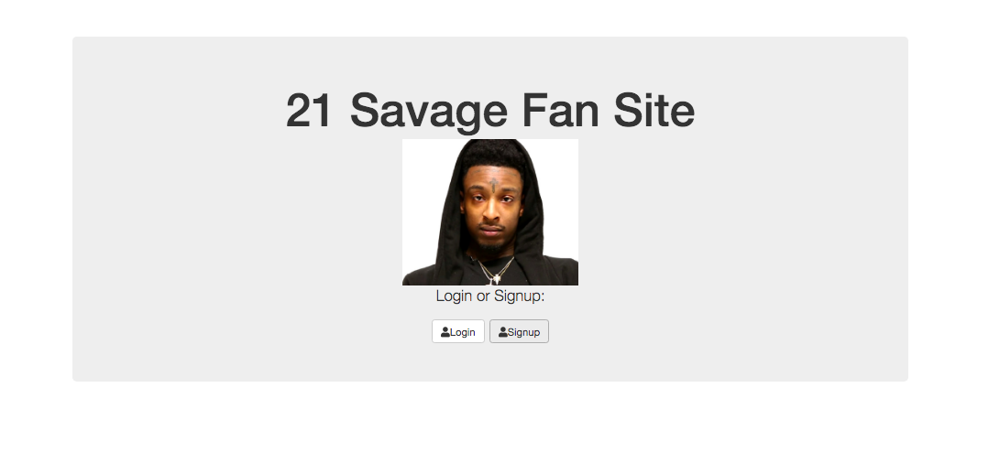
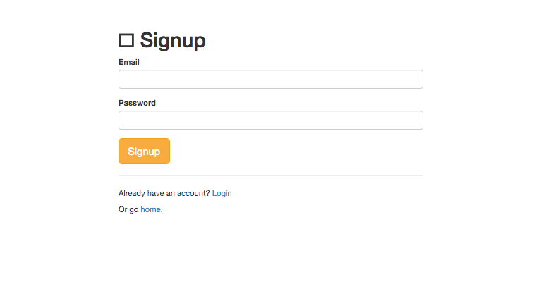
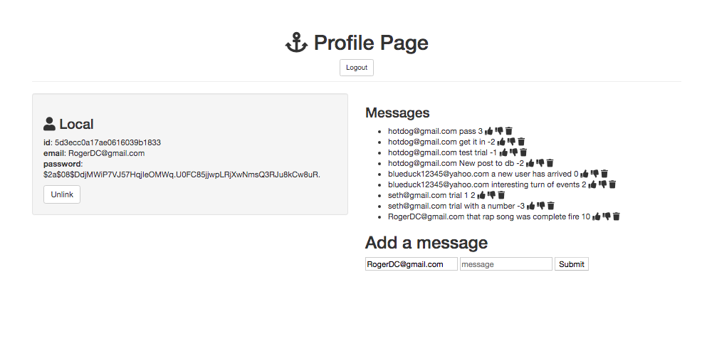

# Savage 21 Full stack App with User Authentication Login
A full stack web app with user authentication login with CRUD functionality that allows savage 21 fans to create a profile and contribute comments to savage 21's rap music. This web application keeps track of all of the comments stated by users by using mongodb database. This app also allows you to thumbs up or thumbs down individual comments. And it allows you to delete your generated comment regarding savage 21's rap music from the database if you wish to do so.

Login Page Cover

Signup Page Cover

Profile Page Cover

## Usage

1. Navigate to `localhost:8080`

## How It's Made:

**Tech used:** HTML, CSS, JavaScript, Node.JS, Express, Mongodb

The project focused on creating client side and server side JavaScript, CSS for styling, and an EJS template to render the html page. This project also used express for building the server API and mongodb database to store the collections and documents containing the data from the interactions with users.

## Optimizations

For future updates I would customize further styling of the page for different individual users profile pages. In addition, I would consider to look into further using passport.js to customize the login credentials with Facebook and Google login.

## Lessons Learned:

I learned that this project has an interesting component of both CRUD App functionality and user authentication login using passport.js. In addition, I learned to work with authentication login capabilities with this initial authentication project.
